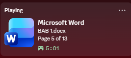

# DiscordRPCforWord

<p align="center">
  
</p>

**DiscordRPCforWord** is an experimental C++ utility that synchronizes your Microsoft Word activity with Discord Rich Presence in real-time. It uses COM Late Binding for compatibility across Office versions like 2016, 2019, 2021, and 365.

> **EXPERIMENTAL**  
> Use at your own risk — this application interacts with Windows COM and active Microsoft Word processes.

## Key Features

- **Dynamic Document Detection**  
  Tracks the active Word document automatically.

- **English Status Display**  
  Shows professional status information such as:

  ```text
  Page 3 of 15
  ```

- **Late Binding COM**  
  Uses `IDispatch` for version-independent Word object model access.

- **Performance Optimized**  
  Low CPU and memory usage with C++17 optimizations.

- **x64 Target**  
  Built for modern Windows systems.

---

## Technical Specs

| Aspect | Details |
|---|---|
| Language | C++17 |
| Core Tech | Discord RPC SDK, Windows COM |
| IDE | Visual Studio 2022 |
| Platform | x64 |
| Runtime Library | Multi-threaded DLL (/MD) |

---

## Dependencies

- **Discord RPC SDK**
  - Place headers in `deps/include`
  - Place `.lib` files in `deps/lib`

- **Windows SDK**
  - Required for COM and UTF-8 support
  - Included with Visual Studio 2022

---

## Build Instructions

1. Clone the repository:

```bash
git clone https://github.com/username/DiscordRPCforWord.git
```

2. Open:

```text
DiscordRPCforWord.sln
```

in Visual Studio 2022.

3. Select configuration:

```text
Release | x64
```

4. Navigate to:

```text
Project Properties
→ C/C++
→ Code Generation
→ Runtime Library
```

Set:

```text
Multi-threaded DLL (/MD)
```

5. Build the solution:

```text
Ctrl + Shift + B
```

---

## Usage

1. Launch Microsoft Word and open a document.
2. Run:

```text
DiscordRPCforWord.exe
```

3. Your Discord Rich Presence will automatically update with:
   - Document name
   - Current page
   - Total page count

### Example

```text
Editing Thesis.docx
Page 3 of 15
```

---

## Preview Image Setup

Place your preview image here:

```text
images/preview.png
```

The image is displayed using:

```html
<p align="center">
  
</p>
```

---

## Project Structure

```text
DiscordRPCforWord/
│
├── src/
├── deps/
│   ├── include/
│   └── lib/
│
├── images/
│   └── preview.png
│
├── README.md
└── DiscordRPCforWord.sln
```

---

## License

MIT License. See the [LICENSE](LICENSE) file for details.

---

## Author

Developed by **Dzikri Maulana**.

Contributions, feedback, and issue reports are welcome.
